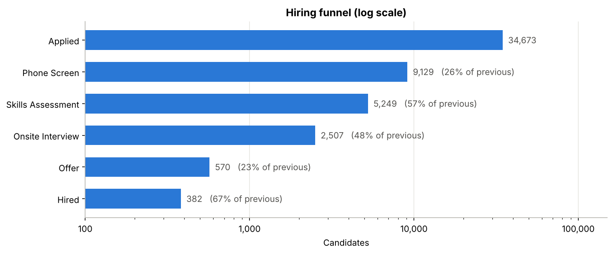
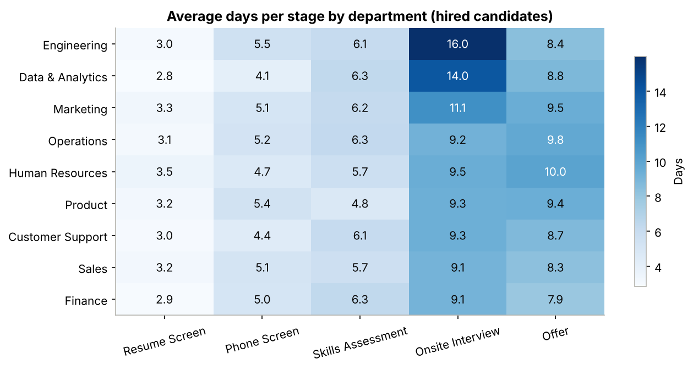
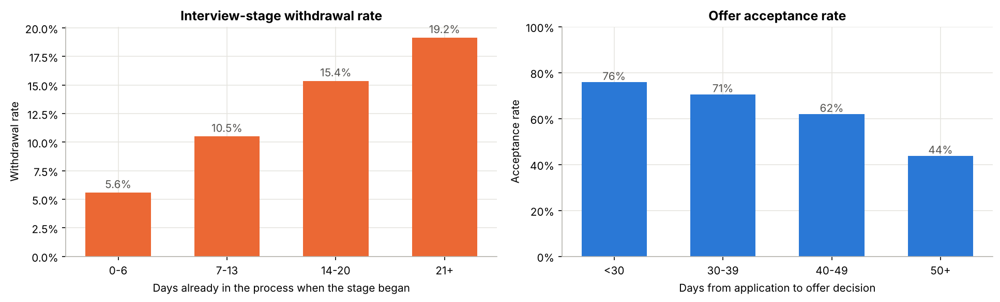
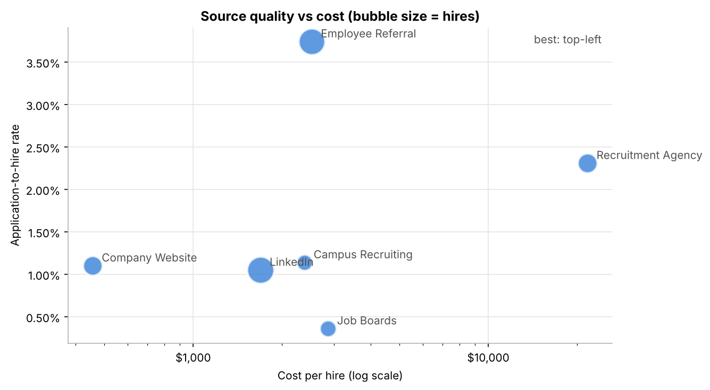
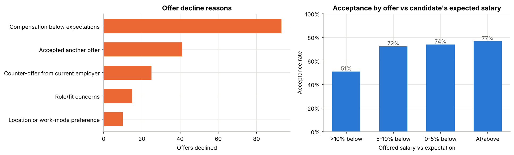
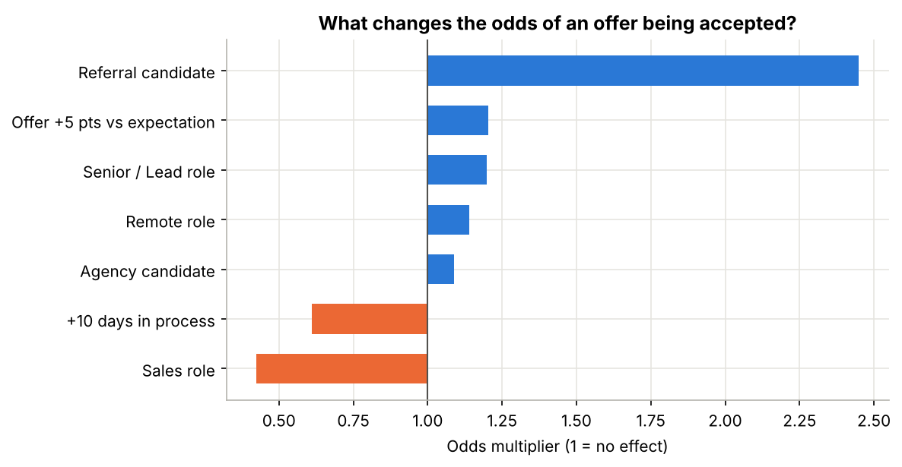
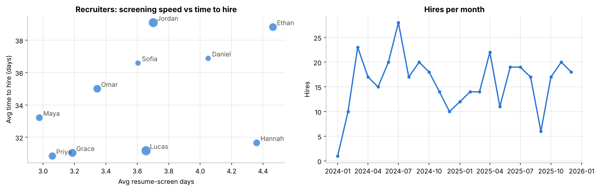

# Recruitment Funnel & Hiring Process Optimization
**Data Analyst Capstone Project · Excel · SQL · Python · Power BI**

## 1. Business problem
A mid-sized company (9 departments, 10 recruiters) hired **382 people from 34,673 applications** over two years, but leadership has three complaints:

1. **Hiring is too slow** — roles take ~44 days to fill and 1 in 4 job openings is closed without a hire.
2. **Good candidates are lost late in the process** — after interviews, or by turning down offers.
3. **Recruiting spend is high** (~$1.8M) and nobody knows which hiring channels are worth it.

**Goal:** find where the hiring funnel leaks, what slows it down and which sources give the best hires for the money — then recommend changes and estimate their impact.

### Key questions
| # | Question |
|---|---|
| 1 | How many candidates make it through each stage, and where do we lose the most? |
| 2 | Which stage is the bottleneck, and in which departments? |
| 3 | Does a slow process cause candidates to withdraw or decline offers? |
| 4 | Which sources give the best hires per dollar (conversion, cost, retention, performance)? |
| 5 | Why are offers declined, and can we predict it? |
| 6 | How do recruiters compare on speed and results? |
| 7 | What would we gain by fixing the biggest bottleneck? |

---

## 2. Data
Synthetic but realistic applicant-tracking-system (ATS) data, **Jan 2024 – Dec 2025**, generated by `scripts/01_generate_data.py` with real-world patterns built in and deliberate data-quality problems to clean.

| Table | Rows | Description |
|---|---|---|
| departments | 9 | Engineering, Data & Analytics, Product, Sales, Marketing, Customer Support, Finance, HR, Operations |
| recruiters | 10 | Recruiter name, team (Tech / Business / G&A) |
| requisitions | 420 | Job openings: department, level, location, recruiter, headcount, salary band, status |
| candidates | 33,292 | Gender, experience, education, city, expected salary |
| applications | 34,673 | Candidate × job: source, applied date, outcome and reason |
| stage_events | 52,128 | Each stage a candidate entered: dates, result (passed / rejected / withdrew), reason |
| offers | 567 | Offered salary, accepted / declined, decline reason |
| hires | 382 | Start date, still employed or left, 6-month performance rating |
| source_spend | 165 | Monthly spend per source (subscriptions, events, agency fees, referral bonuses) |

**Hiring stages:** Resume Screen → Phone Screen → Skills Assessment → Onsite Interview → Offer → Hired

### Data cleaning (`scripts/02_clean_data.py`, demonstrated in Excel on the `Cleaning_Demo` sheet)
| Problem found | Rows | Fix |
|---|---|---|
| Duplicate applications | 277 | Removed |
| Inconsistent source names (`linkedin`, `Linked In`, `Referral`…) | 1,648 | Mapped to 7 standard names |
| Missing source | 139 | Labelled "Unknown" |
| US-style text dates (`09/22/2024`) | 1,040 | Converted to real dates |
| Salary stored as text (`$95k`) | 666 | Converted to numbers |
| Missing gender | 333 | "Not recorded" (kept separate from "Prefer not to say") |
| Duplicate stage records | 150 | Removed |
| Exit date before entry date | 77 | Swapped back |

---

## 3. Tools and workflow
```
 Excel                      SQL                         Python                        Power BI
 first look, cleaning   →   database, joins, views, →   deeper analysis, charts,  →   interactive
 demo, formula-based        20 business queries         offer-acceptance model,       dashboard
 summaries & dashboard      (window functions, CTEs)    what-if simulation            (5 pages)
```

| Tool | File | What it shows |
|---|---|---|
| **Excel** | `excel/recruitment_funnel_analysis.xlsx` | Interactive funnel (dropdown filters), bottleneck heatmap, source scorecard, offer analysis, recruiter scorecard, monthly trend, cleaning demo. 36,000+ live formulas: `COUNTIFS`, `SUMIFS`, `AVERAGEIFS`, `INDEX/MATCH`, data validation, conditional formatting, charts |
| **SQL** | `sql/01_schema.sql`, `02_views.sql`, `03_analysis_queries.sql` | 9-table relational schema with keys and indexes; 2 reporting views; 20 queries using joins, CTEs, `CASE`, window functions (`LAG`, `FIRST_VALUE`, `SUM() OVER`) |
| **Python** | `notebooks/recruitment_analysis.ipynb` | pandas, matplotlib, scikit-learn: funnel, bottleneck heatmap, delay vs. drop-off, source cost vs. quality, logistic-regression model of offer acceptance (cross-validated), what-if simulation |
| **Power BI** | `powerbi/POWER_BI_GUIDE.md` + `data/powerbi/*.csv` | Step-by-step build: Power Query, star-schema model, 30+ DAX measures, 5 report pages, theme file |

---

## 4. Headline KPIs
| KPI | Value |
|---|---|
| Applications | 34,673 |
| Hires | 382 |
| Applications per hire | 91 |
| Average time to hire (application → offer accepted) | **33.9 days** |
| Average time to fill (job opened → filled) | **43.7 days** |
| Offer acceptance rate | **67.5%** |
| Fill rate (closed requisitions filled) | **73.9%** |
| Total recruiting spend | $1,823,239 |
| Cost per hire | **$4,773** |

---

## 5. Findings

### 5.1 The funnel — where candidates drop out


| Stage | Candidates | % of previous stage |
|---|---|---|
| Applied | 34,673 | – |
| Phone Screen | 9,129 | 26.3% |
| Skills Assessment | 5,249 | 57.5% |
| Onsite Interview | 2,507 | 47.8% |
| Offer | 570 | 22.7% |
| Hired | 382 | 67.0% |

- The resume screen removes about 3 in 4 applicants — mostly from low-yield sources.
- The **onsite interview has the highest withdrawal rate (15.1%)** — candidates who have invested the most time are leaving.
- **About 1 in 3 offers is declined** — the most expensive place to lose a candidate.

### 5.2 The bottleneck is the onsite interview


- Onsite interviews take **11.1 days on average — ~31% of total process time**, more than any other stage.
- It is worst in **Engineering (16.0 days)** and **Data & Analytics (14.0 days)**, where multi-person interview panels must be scheduled.
- Engineering also has the **lowest fill rate (62.8%)** — 35 of its 99 openings were closed without a hire.

### 5.3 Slowness costs candidates


- Interview-stage withdrawals climb from **5.6%** (under a week in process) to **19.2%** (3+ weeks) — **3.4× higher**.
- Offers decided within 30 days are accepted **76%** of the time; after 50+ days only **44%**.
- 399 candidates withdrew or declined because they *accepted another offer* or said the *process took too long*.

### 5.4 Sources: referrals win, agencies are expensive, job boards waste time


| Source | Applications | Hires | App→hire | Cost per hire | 12-month retention |
|---|---|---|---|---|---|
| Employee Referral | 2,567 | 96 | **3.74%** | $2,526 | **88%** |
| Recruitment Agency | 2,297 | 53 | 2.31% | **$21,706** | 59% |
| LinkedIn | 9,539 | 100 | 1.05% | $1,694 | 85% |
| Company Website | 4,730 | 52 | 1.10% | **$457** | 79% |
| Campus Recruiting | 3,167 | 36 | 1.14% | $2,388 | 81% |
| Job Boards | 10,610 | 38 | 0.36% | $2,867 | 76% |
| Social Media | 1,624 | 3 | 0.18% | $14,091 | (too few hires) |

- **Referrals** convert 3.5× better than LinkedIn, retain best and have the highest performance ratings (3.6 / 5).
- **Agencies** cost about **8× more per hire** than referrals or job boards, and their hires leave most often in year one.
- **Job boards** produce the most applications (31%) but only 10% of hires — 279 applications screened per hire.

### 5.5 Why offers are declined


- **Pay below expectations causes half of all declines (50.5%)**, followed by competing offers (22.3%).
- Offers more than 10% below the candidate's expected salary are accepted only **51%** of the time vs **77%** at or above expectation.
- **Sales** has the lowest acceptance rate (56%).

**Model:** a logistic regression predicting offer acceptance (cross-validated ROC-AUC **0.74**) confirms the controllable levers:



- **+10 days in process → odds of acceptance × 0.61**
- **Offer 5 points closer to expectation → odds × 1.20**
- Referral candidates have **2.4× the odds** of accepting.

### 5.6 Recruiters


- **Jordan Lee** (heaviest workload, 59 requisitions) and **Ethan Brooks** (slowest first screen, 4.5 days) have the longest time to hire (~39 days) and the lowest fill rates (63%).
- **Lucas Martin** carries a similar load (62 requisitions) with a 31-day time to hire and 85% fill rate — a model to copy.
- Workload is uneven: the busiest recruiters handle **2.5×** the requisitions of the lightest.

### 5.7 Fairness check
Male and female candidates pass every stage at almost identical rates (26.5% resume pass for both; 1.03% vs 1.15% application-to-hire), so there is **no evidence of a gap between the two largest groups**. Smaller groups vary more simply because of small numbers (e.g. non-binary candidates: 22.4% resume pass on 696 applications) — worth monitoring, not conclusive.

---

## 6. Recommendations and expected impact
| # | Recommendation | Why (evidence) | Owner |
|---|---|---|---|
| 1 | **Pre-book weekly interview panel slots** for Engineering and Data & Analytics, aiming to cut onsite time by 5 days | Onsite = slowest stage (16 days in Engineering); delays drive withdrawals | Hiring managers + TA lead |
| 2 | **Set a 30-day application-to-offer target**, tracked weekly in Power BI | Acceptance falls from 76% to 44% as the process passes 50 days | TA lead |
| 3 | **Ask salary expectations at the phone screen**; flag candidates above the band before the onsite | Pay causes 50% of declines | Recruiters + Comp team |
| 4 | **Grow the referral program** (bigger bonus, simpler process); **move job-board and social-media budget** to referrals and the careers site | Referrals: best conversion & retention; careers site: $457 per hire | TA lead + Marketing |
| 5 | **Limit agencies** to hard-to-fill Lead roles | $21.7K per hire, 59% 12-month retention | TA lead |
| 6 | **Rebalance recruiter workload** and pair slower recruiters with the fastest | Two recruiters with 63% fill rate vs 85% for a peer with the same load | Recruiting manager |

**Estimated impact of #1 (what-if simulation in the notebook):** cutting the onsite stage by 5 days would mean about **25 more accepted offers and ~82 fewer onsite withdrawals over two years — roughly 20 extra hires a year, worth ~$95K a year** at the current cost per hire (before counting fewer re-opened roles and agency fees).

---

## 7. Project structure
```
recruitment_funnel_capstone/
├── README.md                     ← this report
├── requirements.txt
├── data/
│   ├── raw/                      ← messy source files (9 CSVs)
│   ├── clean/                    ← cleaned CSVs + cleaning_log.csv
│   ├── powerbi/                  ← model-ready files for Power BI
│   └── recruitment.db            ← SQLite database (created by scripts/03_build_database.py; not stored on GitHub because of its size)
├── sql/
│   ├── 01_schema.sql             ← tables, keys, indexes
│   ├── 02_views.sql              ← vw_application_funnel, vw_requisition_summary
│   ├── 03_analysis_queries.sql   ← 20 business questions
│   └── query_results/            ← output of every query (CSV)
├── notebooks/
│   └── recruitment_analysis.ipynb
├── excel/
│   └── recruitment_funnel_analysis.xlsx
├── powerbi/
│   ├── POWER_BI_GUIDE.md         ← build steps, data model, DAX measures, page layouts
│   └── theme/recruitment_theme.json
├── images/                       ← charts used in this report
└── scripts/
    ├── 01_generate_data.py
    ├── 02_clean_data.py
    ├── 03_build_database.py
    ├── 04_build_excel.py
    └── build_notebook.py
```

## 8. How to reproduce
```bash
pip install -r requirements.txt
python scripts/01_generate_data.py        # raw data (fixed random seed = same numbers every time)
python scripts/02_clean_data.py           # clean data + cleaning log
python scripts/03_build_database.py       # SQLite database, views, run all 20 SQL queries
python scripts/build_notebook.py          # writes the notebook
jupyter nbconvert --to notebook --execute --inplace notebooks/recruitment_analysis.ipynb
python scripts/04_build_excel.py          # Excel workbook (open in Excel; it recalculates on open)
```
Then follow `powerbi/POWER_BI_GUIDE.md` to build the dashboard.

The SQL runs as written in **SQLite** (e.g. DB Browser for SQLite). For **PostgreSQL** or **MySQL**, see the dialect notes at the top of each SQL file.

---

## 9. Limitations
- The data is **synthetic**: patterns were designed to be realistic, so findings demonstrate the method, not facts about a real company.
- Offer counts (566 decided offers) are small, so model estimates have wide uncertainty — results are cross-validated and shown as odds, not exact predictions.
- 12-month retention can only be measured for people who started by Dec 2024 (about 185 hires).
- The what-if simulation assumes the relationships seen in the past stay the same after the process changes.

## 10. Next steps
- Add candidate-experience survey scores to explain withdrawals beyond speed.
- A/B test the pre-booked panel slots in Engineering before company-wide rollout.
- Build a weekly automated refresh (Power BI Service + scheduled data export from the ATS).

---

## Portfolio / résumé bullets
- Built an end-to-end recruitment analytics project (Excel, SQL, Python, Power BI) on 34K applications and 52K stage events across 420 job openings.
- Designed a 9-table SQL schema with reporting views and 20 analytical queries (CTEs, window functions) to measure funnel conversion, stage time and source ROI.
- Identified the onsite interview as the main bottleneck (31% of process time) and showed that candidates waiting 3+ weeks were 3.4× more likely to withdraw.
- Built a cross-validated logistic regression (ROC-AUC 0.74) showing salary gap and process length drive offer declines; estimated ~20 extra hires per year from a 5-day faster onsite stage.
- Delivered an interactive Excel workbook (36K live formulas) and a 5-page Power BI dashboard with 30+ DAX measures.
